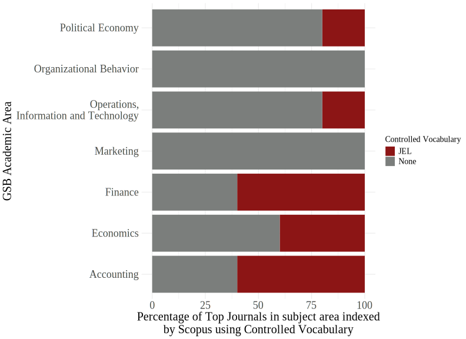
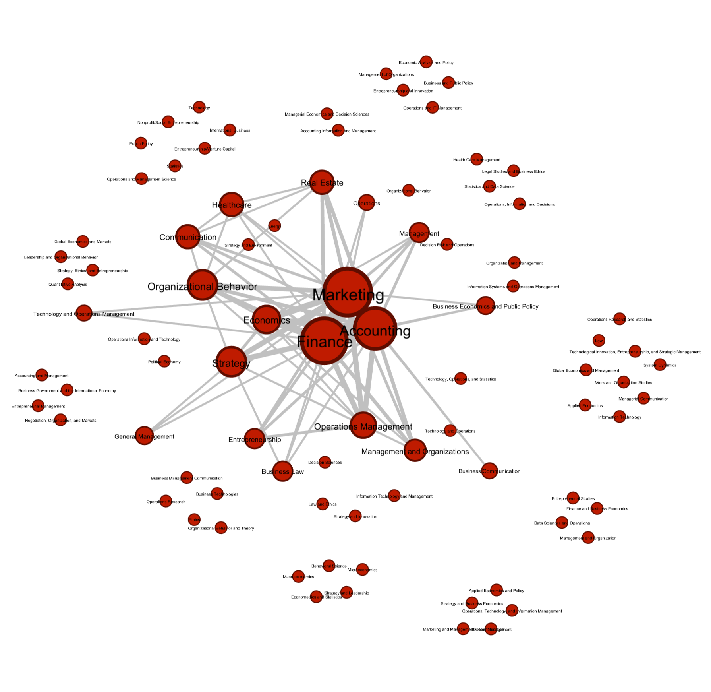
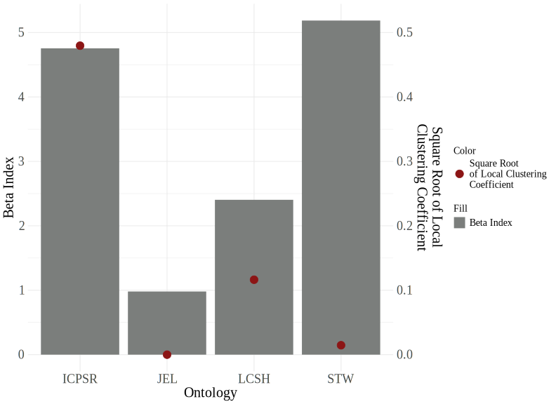

# Data visualizations from 'The Case for a Unified Taxonomy for Business Data'
 
#### Matthew Hutchinson and Ella Hitchcock ####
 
 
### Usage of Taxonomies in the Top Journals ###

 
We surveyed the top journals as ranked by SCOPUS in each of the Stanford GSB's aademic areas to see if they required authors to use a specific taxonomy
to classify their work.  
 
 
 
### Co-occurrence Network of Academic Areas Across the Top 20 Business Schools in the US ###

 
We reviewed the Academic areas in the top twenty US Business schools as ranked by Bloomberg News. A connection between two nodes means two or more Universities use those same terms. Displayed edges have a weight of three or higher and nodes are sized by degree.  
 
 
 
### A comparison of the network structure of each taxonomy ###

 
Each taxonomy was loaded into a Neo4j graph databases using the Neosemantics extension and the graph statistics calculated with the Graph Data Science library. 
The Beta score is the ratio of edges to nodes, describing how densely connected the network is and the Local clustering coefficient describes the tendency of the network to form clusters.